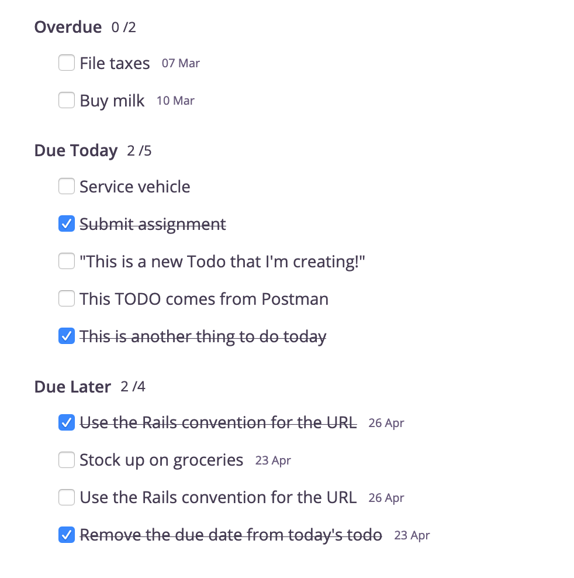

# Text

For this milestone target, you have to update your To-do Manager **Node.js** repository so that it renders the list of to-dos using the HTML & CSS you wrote in the previous level.

## Requirements

1. `/todos` should render nicely, based on the design you had converted to HTML & CSS in the previous level.
2. `/todos` should render the actual list of to-dos from your database (aka: use EJS templates to render it).
3. The EJS file (index.ejs) should use view templates to render the three sections: Overdue, Due Today, and Due Later.
4. All sections except Due Today should show the due date of the to-do along with the text.

All of the above have already been done in the tutorials, so you'll be able to implement them by simply following them.

## New requirements

There are two additional requirements that are not covered in the tutorials:

1. The Overdue section should not list to-dos that are already completed.
2. The Due Today and Due Later sections should list all to-dos that match their date range, including completed ones. However, if a to-do is completed, then its checkbox should be ticked, and the text should be crossed out. Like this:
   
3. Finally, you should deploy this application to Heroku and submit the application URL along with the GitHub source URL.

Tips

- To show a checkbox as ticked, use the checked attribute. [Here's an example](https://www.geeksforgeeks.org/html-checked-attribute/).
- Google about the CSS value line-through to know how to show the text as crossed in the middle.
