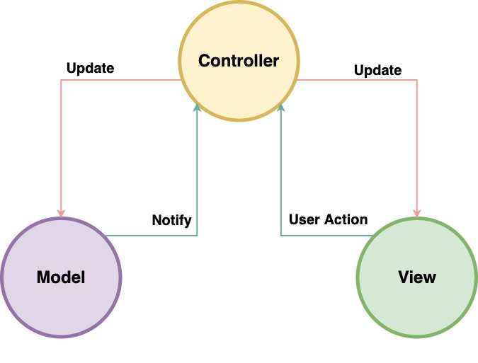

# Text

In the previous levels, we learned how to use templates with Express to create a User Interface for an application. When working on a complex application such as this, it is advisable to use a web design pattern, which helps simplify the development process.

Design pattern in general is a reusable solution which we can use in our application to solve common problems. For example, the Todo application such as ours can have multiple functions and clubbing them all in a single file can create a complex city for handing the data.

In our case, we are using the MVC framework, which is also called a model view controller framework. What this does, is split the application into separate components, each of which performs a specific function.

To understand how to build these applications in general, we need to know more about what the MVC framework is. Let's learn more about it.

## What is MVC

MVC is made up of three parts: Model, View, and Controller. To be more specific, it divides the application into three logical parts: the model, the view, and the controller.

This is done to separate internal data from how information is presented to and accepted by the user. This framework is now supported by almost all popular programming languages.

## The Model

The pattern's central component is the **model**. It is the data structure of the application, independent of the user interface. It corresponds to all the data-related logic with which the user interacts. It directly manages the application's data, and logic.

## The View

A **view** can be any type of information output representation, such as a chart or diagram or even a table. Multiple views of the same data, such as a chart representing recent transactions or a list of Todo's in our case, are possible.

## The Controller

The **controller** accepts input and converts it into the model or view commands. It serves as an interface between the Model and View components, processing all business logic and incoming requests, manipulating data with the Model, and interacting with the Views to render the final output.

## Component Interaction

The model-view-controller design not only divides the application into three types of components, but also defines the interactions between them.

1.  The View requests data to be displayed, and the request is taken by the Controller.
2.  The Controller gets the necessary data from the Model and modifies it based on the User's need.
3.  The View receives the final data from the Controller and displays the same to the User.

The Controller is the most important part of this Interaction, and it benefits from having two-way communication with both the View and the Model.

## Benefits of MVC

The MVC pattern provides a lot of benefits for our development.

1. Multiple developers can work on the model, controller, and views at the same time.
2. MVC allows for the logical grouping of related functions.
3. Because the components are separated, future development or modification is simplified.
4. Models with multiple views — Models can have multiple views. (Different applications can be built using the same Todo data structure.)

You can learn more about MVC and ways to use the framework in your application from the references below:

[The Model View Controller Pattern - FreeCodeCamp](https://www.freecodecamp.org/news/the-model-view-controller-pattern-mvc-architecture-and-frameworks-explained/)
