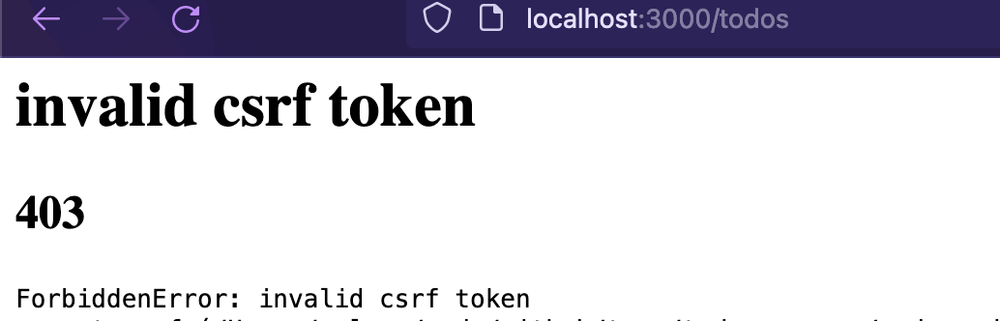

## Text

In this lesson, we will learn to secure our application against Cross site scripting attacks (XSS attacks).

We prevent XSS attacks by making sure a unique token for a client session is being passed with every request (CSRF token). We use `csurf` package to add this capability to our express.js application. Let's first add it to our project.

```sh
npm install csurf
```

Next, we need to use this package in our express.js application. Edit the `app.js` file to add the following content.

```js
var csrf = require("csurf");

// ...

app.use(express.urlencoded({ extended: false }));
app.use(cookieParser());
app.use(csrf({ cookie: true }));
```

That's it! We are all set. Now, our application expects a CSRF token with every `POST`, `PUT` and `DELETE` requests.

If we try to add a new todo, we should get a error showing `invalid csrf token`.


Let's fix that.

Edit the `app.js` file to generate a csrf token.

```js
app.get("/", async (request, response) => {
  const overdue = await Todo.overdue();
  const dueToday = await Todo.dueToday();
  const dueLater = await Todo.dueLater();
  if (request.accepts("html")) {
    response.render("index", {
      title: "Todo application",
      overdue,
      dueToday,
      dueLater,
      csrfToken: request.csrfToken(),
    });
  } else {
    response.json({
      overdue,
      dueToday,
      dueLater,
    });
  }
});
```

Next, we will render it in our todo creation form. We do that by adding the token as a _hidden_ field, which will automatically get submitted.

```html
<form action="/todos" method="POST">
  <input type="hidden" name="_csrf" value="<%= csrfToken %>" />
  <div class="flex gap-2 py-4">
    <div class="flex-auto">
      <input
        type="text"
        placeholder="What's next?"
        name="title"
        class="border border-gray-300 rounded text-gray-900 w-full p-2 text-sm"
        required
      />
    </div>
    <div class="flex-auto">
      <input
        type="date"
        name="dueDate"
        class="border border-gray-300 rounded text-gray-900 w-full p-2 text-sm leading-4	"
      />
    </div>
    <div class="flex-none">
      <button
        type="submit"
        class="bg-green-600	text-white px-5 py-1.5 rounded font-medium mr-2 mb-2"
      >
        Add
      </button>
    </div>
  </div>
</form>
```

Save the file and server should restart automatically.

We should now be able to create new todo items as before. Next, we need to send the csrf token with our `PUT` and `DELETE` requests.

To do that, we will first add a `meta` tag which will render the token. Then we will get the token using JavaScript selector and then pass them with each request.

Add a new `meta` tag in `head` of the `index.ejs` file.

```html
<title>TO-DO Manager</title>
<meta name="viewport" content="width=device-width, initial-scale=1.0" />
<meta name="csrf-token" content="<%= csrfToken %>" />
```

Next, before we fire a request using `fetch`, we will get the token and inject it into the request.

```js
var token = document.querySelector('meta[name="csrf-token"]').getAttribute('content');

function updateTodo(id) {

  fetch(`/todos/${id}`, {
    credentials: 'same-origin',
    method: 'put',
    headers: {
      'Content-Type': 'application/json',
      'CSRF-Token': token
    },
  }).then((res) => {
    window.location.reload();
  }).catch(err => console.error(err))
}

function deleteTodo(id) {
  console.log(id);

  fetch(`/todos/${id}`, {
    credentials: 'same-origin',
    method: 'delete',
    headers: {
      'Content-Type': 'application/json',
      'CSRF-Token': token
    },
  }).then((res) => {
    window.location.reload();
  }).catch(err => console.error(err))
}
```

We pass the token as a http header. We also ask the browser to send the cookies along with the requests using `credentials: 'same-origin'`.

Now we should be able to get our back to working state. But our tests will be failing now. Try running our tests.

```js
npm test
```

Let's fix that.

To get the csrf token, we will simply send a `GET` request to our server, extract the CSRF token from response, then send it along with our `POST` or `PUT` requests. To inspect the response from server, we will use a package called `cheerio`. Let's install that.

```sh
npm install --save-dev cheerio
```

Now import it in our test file.

```js
var cheerio = require("cheerio");
```

Let's add a function in `__tests__/todo.js` to extract the csrf token

```js
function extractCsrfToken(res) {
  var $ = cheerio.load(res.text);
  return $("[name=_csrf]").val();
}
```

Now, we can rewrite the test for creating a new item

```js
test("create a new todo", async () => {
    agent = request.agent(server);
    const res = await agent.get("/");
    const csrfToken = extractCsrfToken(res);
    const response = await agent.post("/todos").send({
      _csrf: csrfToken,
      title: "Buy milk",
      dueDate: new Date().toISOString(),
      completed: false,
    });
    expect(response.statusCode).toBe(302);
  });
```

Similarly, we can modify the test for mark as complete

```js
test("Mark a todo as complete", async () => {
    agent = request.agent(server);
    const res = await agent.get("/");
    const csrfToken = extractCsrfToken(res);
    await agent.post("/todos").send({
      _csrf: csrfToken,
      title: "Buy milk",
      dueDate: new Date().toISOString(),
      completed: false,
    });

    const groupedTodosResponse = await agent
      .get("/")
      .set("Accept", "application/json");
    const parsedGroupedResponse = JSON.parse(groupedTodosResponse.text);

    expect(parsedGroupedResponse.dueToday).toBeDefined();

    const dueTodayCount = parsedGroupedResponse.dueToday.length;
    const latestTodo = parsedGroupedResponse.dueToday[dueTodayCount - 1];

    const markCompleteResponse = await agent
      .put(`/todos/${latestTodo.id}`)
      .send({
        _csrf: csrfToken,
      });
    const parsedUpdateResponse = JSON.parse(markCompleteResponse.text);
    expect(parsedUpdateResponse.completed).toBe(true);
  });
```

Save the file, and run the tests.

```
npm test
```
The tests should all be working now.
