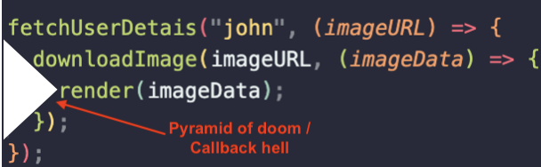

## Text

In this lesson, we will learn about callback, promise, and async - await in JavaScript.

Let us take an example where a user image is being displayed. To do that, we will have to:

1. Fetch user details.
2. Download user image.
3. Render the image.

Let us write some JavaScript code to mock these steps. Since, these steps are asynchronous, to do one after the other, we have to pass the next step as a callback to the function. We will mimic the asynchronous nature using `setTimeout` here. Let's create a file `render.js`:

```js
// render.js
const fetchUserDetails = (userID, next) => {
  console.log("Fetching user details");

  setTimeout(() => {
    next(`https://image.example.com/${userID}`);
  }, 1000);
};

const downloadImage = (imageURL, next) => {
  console.log("Downloading image");
  setTimeout(() => {
    next(`Data from ${imageURL}`);
  }, 1000);
};

const render = (image) => {
  setTimeout(() => {
    console.log(`Render image: ${image}`);
  }, 1000);
};

fetchUserDetails("john", (imageURL) => {
  downloadImage(imageURL, (imageData) => {
    render(imageData);
  });
});
```

To run the program, execute the following command.

```sh
node render.js
```

You should see an out like the following.

```
Fetching user details
Downloading image
Render image: Data from https://image.example.com/john
```

Now, imagine, if you had some other functions like resizing the image, applying some trasnformation etc, then the sample code would look something like:

```js
fetchUserDetails("john", (imageURL) => {
  downloadImage(imageURL, (imageData) => {
    resizeImage(imageData, (resizedImage) => {
      transformImage(resizedImage, (transformedImage) => {
        render(transformedImage);
      });
    });
  });
});
```

This gets complicated very quickly. This pattern is called [Pyramid of doom](<https://en.wikipedia.org/wiki/Pyramid_of_doom_(programming)>) or a [callback hell](http://callbackhell.com/).



## Promises

Promises were introduced in [ES6](https://www.w3schools.com/js/js_es6.asp) version of JavaScript to make asynchronous code more readable. A `Promise` would be in one of the following states:

- pending: initial state, neither fulfilled nor rejected.
- fulfilled: meaning that the operation was completed successfully.
- rejected: meaning that the operation failed.

We can create a new `Promise` using the following syntax:

```js
const aPromise = new Promise((resolve, reject) => {});
```

We can either `resolve` the promise to change it to `fulfilled` state or `reject` it to change the state to `rejected`. We can chain multiple promises to mimic synchronous behaviour using `then`:

```js
aPromise
  .then(handleFulfilledA, handleRejectedA)
  .then(handleFulfilledB, handleRejectedB)
  .then(handleFulfilledC, handleRejectedC);
```

We can rewrite our code to use `Promise`.

```js
const fetchUserDetails = (userID) => {
  console.log("Fetching user details");
  return new Promise((resolve, reject) => {
    setTimeout(() => {
      resolve(`https://image.example.com/${userID}`);
    }, 1000);
  });
};

const downloadImage = (imageURL, next) => {
  console.log("Downloading image");
  return new Promise((resolve, reject) => {
    setTimeout(() => {
      resolve(`Data from ${imageURL}`);
    }, 1000);
  });
};

const render = (image) => {
  return new Promise((resolve, reject) => {
    setTimeout(() => {
      console.log(`Render image: ${image}`);
      resolve();
    }, 1000);
  });
};

fetchUserDetails("john")
  .then((imageURL) => downloadImage(imageURL))
  .then((imageData) => render(imageData))
  .catch((err) => {
    console.err(err);
  })
  .finally(() => {
    console.log("Done!");
  });
```

We can further simplify the code to be:

```js
fetchUserDetails("john")
  .then(downloadImage)
  .then(render)
  .catch((err) => {
    console.err(err);
  })
  .finally(() => {
    console.log("Done!");
  });
```

Any error or rejection of promise will be caught by `.catch` block. `.finally` gets executed once everything is complete on a promise chain.

## Async / Await

The keywords `async` and `await` were introduced in ECMAScript 2017. It is a syntactic sugar for `Promise`. Even though `Promise` made code more readable, chaining a lot of them were still tedious.

Keyword `async` can only be used with a function declaration. It tells the JS runtime to wrap the function within a `Promise`. So a function marked as `async` would return a Promise and value would be returned when the promise is fulfilled.

Keyword `await` can only be used with a `Promise`. It can only be used within a function which is marked as `async`. The `await` keyword tells the JS runtime to hold the program execution till the promise is resolved or rejected.

We can now rewrite our sample code to use async / await:

```js
const time = async (ms) => {
  return new Promise((resolve, reject) => {
    setTimeout(() => {
      resolve();
    }, ms);
  });
};
const fetchUserDetails = async (userID) => {
  console.log("Fetching user details");
  await time(1000);
  return `https://image.example.com/${userID}`;
};

const downloadImage = async (imageURL, next) => {
  console.log("Downloading image");
  await time(1000);
  return `Data from ${imageURL}`;
};

const render = async (image) => {
  await time(1000);
  console.log(`Render image: ${image}`);
};

const run = async () => {
  try {
    const userDetails = await fetchUserDetails("john");
    const imageData = await downloadImage(userDetails);
    await render(imageData);
  } catch (err) {
    console.error(err);
  }
};
run();
```

We have marked functions as `async` and we had to write a helper funcion `time` to add some delay before the function returns a value.

Also since our functions are `async`, we had to write a `run` function so that we can wait on the `async` functions using the `await` keyword.

The code looks like a synchronous one and is much easier to read. Any errors that happen will get thrown and will be caught using the `try..catch` block.


## Further Reading

You can learn more about async / await from [Mozilla Developer Network](https://developer.mozilla.org/en-US/docs/Web/JavaScript/Reference/Statements/async_function)
